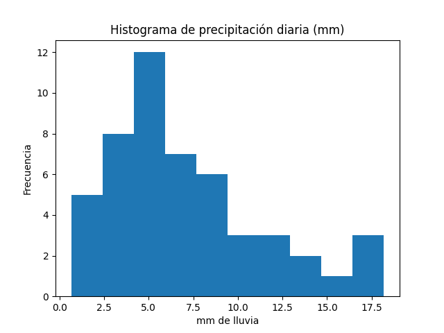

# Análisis de precipitación diaria

Este proyecto modela la **cantidad de lluvia diaria (mm de precipitación)** en la ciudad de Chihuahua utilizando distribuciones de probabilidad.

📓 Notebook: [Act-4.1.ipynb](./Act-4.1.ipynb)

---

## 1. Proceso seleccionado
Se analiza la cantidad de lluvia diaria durante un periodo de días consecutivos.

## 2. Atributo a medir
La variable medida es la **precipitación diaria en milímetros (mm)**.

## 3. Origen de los datos
Los datos pueden provenir de fuentes públicas como CONAGUA o plataformas como Kaggle.  
Para este análisis se usan entre 30 y 50 observaciones.

## 4. Histograma
El histograma muestra que la mayoría de los días tienen poca o nula lluvia, mientras que pocos días presentan valores altos.

Esto genera una distribución **asimétrica hacia la derecha**, sugiriendo modelos como:
- Exponencial  
- Gamma  

---

## 5. Ajuste de distribución
Se utilizó Python con la librería `fitter` para encontrar la distribución que mejor se ajusta a los datos.

Se compararon las distribuciones exponencial, normal y gamma utilizando métricas como error cuadrático, AIC y prueba KS.

**Resultados del ajuste:**

| Distribución | Error | AIC | KS |
|-------------|------|-----|----|
| Gamma       | 0.6906 | 280.04 | 0.0773 |
| Normal      | 0.7457 | 290.61 | 0.1429 |
| Exponencial | 0.8145 | 291.08 | 0.2166 |

**Resultado:**  
La distribución **Gamma** es la mejor, ya que presenta:
- Menor error  
- Menor AIC  
- Mejor estadístico KS  

---

## 6. Parámetros de la distribución

Parámetros obtenidos para la distribución Gamma:

- **k (forma / a):** 2.88  
- **θ (escala / scale):** 2.51  
- **loc:** -0.07  

Interpretación:
- La distribución está sesgada a la derecha  
- Predominan días con poca lluvia  
- Existen pocos eventos de lluvia intensa  

---

## 7. Reflexión
Los parámetros de la distribución permiten describir el comportamiento de la lluvia en la región.

El modelo Gamma obtenido permite aproximar el comportamiento real de la precipitación diaria y estimar probabilidades de eventos extremos.

Este modelo puede utilizarse para:
- Estimar lluvias intensas  
- Apoyar decisiones agrícolas o urbanas  
- Prevenir inundaciones  

También es posible comparar este comportamiento con otras ciudades o temporadas (por ejemplo, verano vs invierno), lo que permite identificar patrones y tomar decisiones basadas en datos.